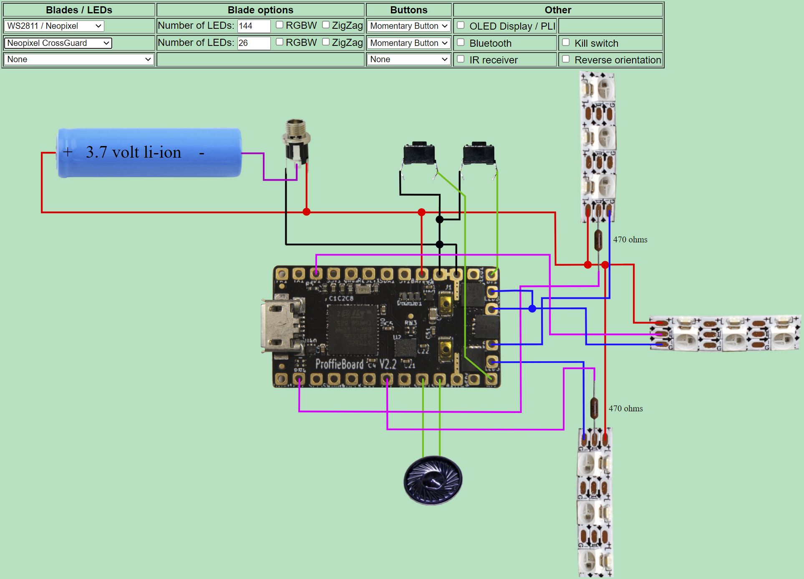

# [Amban sniper rifle](https://starwars.fandom.com/wiki/Amban_sniper_rifle) electronics


Electronics for an Amban sniper rifle from the Mandalorian. This adds lighting and sound effects leveraging the blaster config from the Proffie sound board.

## What I used for this setup:

1) [Proffie 1.5 sound board](https://fredrik.hubbe.net/lightsaber/v4/) (also will work with the [Proffie 2.2 board](https://fredrik.hubbe.net/lightsaber/v5/)) - available [here](https://www.korbanth.com/collections/saber-parts/products/proffie-soundboard-v2-2-with-sd-card) or [here](https://thesaberarmory.com/product/proffieboard-v2-2-open-source-sound-board-16gb-micro-sd/)
2) [Side NeoPixel strip](https://www.adafruit.com/product/3729) for the forks - just one strip cut in half. You can get them from the [manufacturer](http://www.ipixelleds.com/index.php?id=151) in China for about 1/3 the price if you are ordering in bulk
3) Single [NeoPixel](https://www.adafruit.com/product/1260) for the center of the fork, or use [this](https://www.adafruit.com/product/1612) or even a [bare pixel](https://www.adafruit.com/product/1655)
3) [28mm 4W speaker](https://tcsdcc.com/1694) - common speaker used in saber installs
4) [18650 Battery](https://www.thecustomsabershop.com/TrustFire-Protected-37V-2400mAh-18650-Li-Ion-Battery-2-pack-P517.aspx)
5) [Battery holder](https://www.thecustomsabershop.com/18650-Single-Cell-Holder-P886.aspx) - you could also put it into the cartridge slot where the round would go
6) [Power jack](https://www.thecustomsabershop.com/Switchcraft-21mm-Power-Jack-P822.aspx) (recharge port) - or just use any power switch
7) A [Kill Key](https://www.thingiverse.com/thing:3188361) if you are using the recharge port. Inserting this turns off the power.
7) 2 momentary switches. I used [this](https://www.amazon.com/gp/product/B073TYWX86/ref=ppx_yo_dt_b_asin_title_o05_s01?ie=UTF8&psc=1) and [this](https://www.amazon.com/gp/product/B06XT3FLVM/ref=ppx_yo_dt_b_asin_title_o05_s01?ie=UTF8&psc=1) in my setup.
8) [22 gauge](https://www.amazon.com/Remington-Industries-22PTFESTRBLA25-Stranded-Diameter/dp/B0713TNFL5/ref=sr_1_31?keywords=22+gauge+ptfe+wire&qid=1580603237&sr=8-31) to [26 gauge](https://www.amazon.com/Remington-Industries-26PTFESTRRED25-Stranded-Diameter/dp/B0727S6395/ref=sr_1_82?keywords=26+gauge+ptfe+wire&qid=1580603341&sr=8-82) PTFE wire, but just about any wire will do. PTFE insulation is small, and does not melt like PVC
9) [330 ohm resistor](https://www.amazon.com/RadioShack-8-Watt-Carbon-Resistors-5-Pack/dp/B007Z7P9AM/ref=sr_1_26?crid=2L9IDWUX9FI5J&keywords=330+ohm+resistors+1%2F8+watt&qid=1580605256&sprefix=330+ohm%2Caps%2C217&sr=8-26) (1/8 watt) for each of the 3 data lines going to the NeoPixels. Here's another [source](https://www.mouser.com/ProductDetail/71-RN55D3300FTR). If you are using a Proffie 2.2, then you'll only need 2 [470 ohm resistors](https://www.mouser.com/ProductDetail/Vishay-Dale/RN55D4700FRE6?qs=%2Fha2pyFadugp4AYbWju4DdnJwbPUUapgYCZc5X3B4HuUhTTCsheT7g%3D%3D)

## Proffie Setup

The Proffie is an Arduino based board. You'll need to get your PC setup with the right tools. Instructions are [here](https://github.com/profezzorn/arduino-proffieboard/blob/master/README.md), and you can find information on the main [Proffie discussion board](http://therebelarmory.com/board/97/profezzorns-lab).

1) [Proffie OS 3.9](https://fredrik.hubbe.net/lightsaber/proffieos.html) or later
2) SD card with all of the sound files. Download the [ZIP file](SDCard.zip) and copy them to the SD Card. Replace the file tracks\Mando9.wav with the background music of your choice. The file needs to be a 44,100 Hz WAV file
3) Copy the [Amban_config.h](Amban_config.h) file to the config folder in the ProffieOS install. It is setup for a Proffie 1.5 by default, so if you are running Proffie 2.2 modify the top of the code to select the correct header file. It should look like this:

```c
//#include "proffieboard_v1_config.h" // Proffie 1.5
#include "v3_config.h"            // Proffie 2.2
```
4) Double click the **ProffieOS.ino** file from the Proffie install (under the Arduino folder) to launch the project
5) Comment out the default config file, and add the Ambian include file. It should look like this:

```c
// #define CONFIG_FILE "config/default_proffieboard_config.h"
// #define CONFIG_FILE "config/default_v3_config.h"
// #define CONFIG_FILE "config/crossguard_config.h"
// #define CONFIG_FILE "config/graflex_v1_config.h"
// #define CONFIG_FILE "config/prop_shield_fastled_v1_config.h"
// #define CONFIG_FILE "config/owk_v2_config.h"
// #define CONFIG_FILE "config/test_bench_config.h"
// #define CONFIG_FILE "config/toy_saber_config.h"
// #define CONFIG_FILE "config/proffieboard_v1_test_bench_config.h"
// #define CONFIG_FILE "config/td_proffieboard_config.h"
#define CONFIG_FILE "config/Amban_config.h"
```
6) Configure the number of LEDs for each strip (or "blade") at the bottom of Amban_config.h. In the example below, the center NeoPixel has 1 LED, and the two strips have 30 LEDs each. Edit the number immediately after **WS2811BladePtr<**
```c
BladeConfig blades[] = {
 { 0, 
   WS2811BladePtr<1, WS2811_ACTUALLY_800kHz | WS2811_GRB>(),
   WS2811BladePtr<30, WS2811_ACTUALLY_800kHz | WS2811_GRB, blade2Pin, PowerPINS<bladePowerPin4> >(),
   WS2811BladePtr<30, WS2811_ACTUALLY_800kHz | WS2811_GRB, blade3Pin, PowerPINS<bladePowerPin5> >(),
   CONFIGARRAY(presets) },
};
``` 
7) Compile and download the code to the Proffie. Make sure you have the SD card setup and inserted into the Proffie board. You'll need the battery hooked up to play sounds even if it is connected to a PC through USB

## Proffie 1.5 Wiring

This is a basic Proffie crossguard setup where the single NeoPixel is in the center, and the strips on the forks are on the sides. Pay attention to the direction of the arrows on the data pin of the NeoPixels. Data only goes in one direction.


## Proffie 2.2 Wiring

This is a basic Proffie crossguard setup where the single NeoPixel is in the center, and the strips on the forks are on the sides. Pay attention to the direction of the arrows on the data pin of the NeoPixels. Data only goes in one direction.



## Proffie Resources

- [Proffie 1.5 page](https://fredrik.hubbe.net/lightsaber/v4/)
- [Proffie 2.2 page](https://fredrik.hubbe.net/lightsaber/v5/)
- [Proffie OS](https://fredrik.hubbe.net/lightsaber/proffieos.html)
- [Proffie GitHub](https://github.com/profezzorn/arduino-proffieboard/blob/master/README.md) with instructions
- Here's a nice [setup tutorial](https://www.youtube.com/watch?v=JMNg-pkQrA4&fbclid=IwAR0gjirY-aR6i-7L1IlWFe4KIV8D3-mI8-kNjwR4FrIbxL6cVWXC3I72UBI) on getting started with a Proffie 2.2
- [Proffie discussion board](http://therebelarmory.com/board/97/profezzorns-lab) and a [newbie thread](http://therebelarmory.com/thread/10207/proffieboard-newbie-thread)
